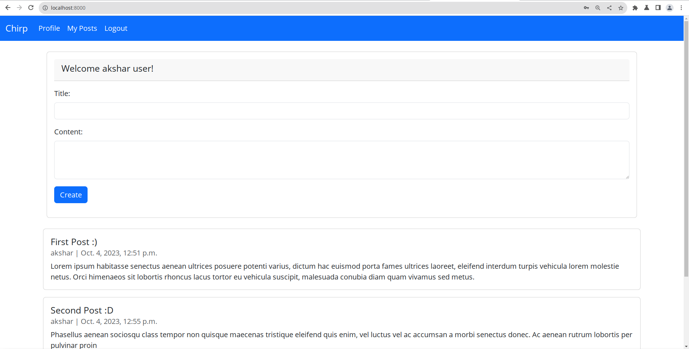

# Python and Web Programming Final Project: Chirp (Twitter Clone)

<!-- metadata (use pandoc) 
% title: Python and Web Programming Final Project: Chirp (Twitter Clone)
% author: Akshar Patel (12102110501003) CSE-IoT Batch A
% date: October 04, 2023
-->

## 1. Setting up venv 

- Enter the following command based on your shell to create a virtual environment named .venv in the current directory

```bash
python -m venv .venv
# Only run one of the following commands
.venv/bin/activate.ps1              # For PowerShell
.venv/bin/activate                  # For Bash
.venv/Scripts/activate.bat          # For CMD
source .venv/Scripts/activate.fish  # For Fish
```

## 2. Installing dependencies

- Use the requirements.txt file to install all the dependencies provided in this project

```bash
pip install -r requirements.txt
```

## 3. Make a project in the current directory

- Make sure you are in the root directory of the project and run the following command

```bash
django-admin startproject project .
```

## 4. Make an app in the project

- Make sure you are in the root directory of the project and run the following command which will create an app named app

```bash
python manage.py startapp app
```

## 5. Register the app in `project/settings.py`

- Go to `project/settings.py` and add the following line in the `INSTALLED_APPS` list

```python
INSTALLED_APPS = [
    ...
    'app.apps',
]
```

## 6. Start a supabase project

- Create a supabase project to use their postgres database.


## 7. Change project `settings.py` file

- Your .env format should be like this

```bash
DB_NAME=your_db_name
DB_USER=your_db_user
DB_PASSWORD=your_db_password
DB_HOST=your_db_host
DB_PORT=your_db_port
```

- Go to settings.py file and change the following

```python
from decouple import config

...

DATABASES = {
    'default': {
        'ENGINE': 'django.db.backends.postgresql',
        'NAME': config('DB_NAME'),
        'USER': config('DB_USER'),
        'PASSWORD': config('DB_PASSWORD'),
        'HOST': config('DB_HOST'),
        'PORT': config('DB_PORT'),
    }
}

...
```

## 8. Migrate the database

- Run the following command to migrate the database

```bash
python manage.py makemigrations
python manage.py migrate
```

## 9. Go to `app/models.py` and create the following models

```python
from django.db import models
from django.contrib.auth.models import User
from django.utils import timezone

# User: inbuilt model

class Post(models.Model):
    content = models.TextField()
    date_posted = models.DateTimeField(default=timezone.now)
    author = models.ForeignKey(User, on_delete=models.CASCADE)

    def __str__(self):
        return self.content

class Comment(models.Model):
    content = models.TextField()
    date_posted = models.DateTimeField(default=timezone.now)
    author = models.ForeignKey(User, on_delete=models.CASCADE)
    post = models.ForeignKey(Post, on_delete=models.CASCADE)

    def __str__(self):
        return self.content
``` 

## 10. Go to `app/admin.py` and register the models

```python
from django.contrib import admin
from app.models import Post, Comment

admin.site.register(Post)
admin.site.register(Comment)
```

## 11. Make a folder named `templates` in the app folder and add `base.html` in it

- We are going to add bootstrap to our project so we need to add the following code in the `base.html` file

```html

<!DOCTYPE html>
<html lang="en">
	<head>
		<meta charset="UTF-8" />
		<meta name="viewport" content="width=device-width, initial-scale=1" />
		<title>Chirp</title>
		<link
			href="https://cdn.jsdelivr.net/npm/bootstrap@5.3.2/dist/css/bootstrap.min.css"
			rel="stylesheet"
			integrity="sha384-T3c6CoIi6uLrA9TneNEoa7RxnatzjcDSCmG1MXxSR1GAsXEV/Dwwykc2MPK8M2HN"
			crossorigin="anonymous"
		/>
		<link rel="stylesheet" href="" />
	</head>
	<body>
		<nav
			class="navbar navbar-expand-lg bg-primary sticky-top"
			data-bs-theme="dark"
		>
			<div class="container-fluid">
				<a class="navbar-brand" href="/">Chirp</a>
				
				<a href="signup/"
					><button class="btn btn-light" type="button">
						Sign up
					</button></a
				>
				
				<button
					class="navbar-toggler"
					type="button"
					data-bs-toggle="collapse"
					data-bs-target="#navbarNavAltMarkup"
					aria-controls="navbarNavAltMarkup"
					aria-expanded="false"
					aria-label="Toggle navigation"
				>
					<span class="navbar-toggler-icon"></span>
				</button>
				<div class="collapse navbar-collapse" id="navbarNavAltMarkup">
					<div class="navbar-nav">
						<a class="nav-link active" href="/">Profile</a>
						<a class="nav-link active" href="/">My Posts</a>
					</div>
				</div>
				
			</div>
		</nav>
		<main id="content"> </main>
		<script
			src="https://cdn.jsdelivr.net/npm/bootstrap@5.3.2/dist/js/bootstrap.bundle.min.js"
			integrity="sha384-C6RzsynM9kWDrMNeT87bh95OGNyZPhcTNXj1NW7RuBCsyN/o0jlpcV8Qyq46cDfL"
			crossorigin="anonymous"
		></script>
	</body>
</html>
```

## 12. Adding the index page feature

### 12.1 Go to `templates/index.html` and add the following code

```html


 
    Index Page 




<div class="login-status">
    
        <a>Log Out</a>
    
    <div class="card card-create-post m-4 p-3 position-relative">
        <div class="card-blur-elements">
            <div class="mb-3">
                <label for="post-title" class="form-label">Title:</label>
                <input type="text" class="form-control" id="post-title" disabled>
            </div>
            <div class="mb-3">
                <label for="post-content" class="form-label">Content:</label>
                <textarea class="form-control" id="post-content" rows="3" disabled></textarea>
            </div>
            <button type="submit" class="btn btn-primary mb-3" disabled>Create</button>
        </div>
        <div class="card position-absolute top-50 start-50 translate-middle card-please-login">
            <div class="card-body">
                <p class="card-text">Please login to create a post</p>
                <button class="btn btn-primary create-post-login-btn">Login</button>
            </div>
        </div>
    </div>
    
</div>
    
    <div class="card-container">
        
            <div class="card">
                <div class="card-body">
                    <h5 class="card-title">{{ post.title }}</h5>
                    <h6 class="card-subtitle mb-2 text-body-secondary">{{ post.author }} | {{post.date_posted}}</h6>
                    <p class="card-text">{{ post.content }}</p>
                </div>
            </div>
        
    </div>


```

### 12.2. Go to `app/views.py` and add the following code

```python
from django.shortcuts import render
from app.models import Post

def index(request):
    posts = Post.objects.all()
    context = {
        'posts': posts,
        'isLogin': request.user.is_authenticated,
        'username': request.user.username if request.user.is_authenticated else ''
    }
    return render(request, 'index.html', context)
```

### 12.3. Go to `app/urls.py` and add the following code

```python
from django.urls import path
from . import views

urlpatterns = [
    path('', views.index, name='index'),
]
```

### 12.4. Go to `project/urls.py` and add the following code

```python
from django.contrib import admin
from django.urls import path, include
from django.conf.urls.static import static
from django.conf import settings

urlpatterns = [
    path('admin/', admin.site.urls),
    path('', include('app.urls'), name='app'),
] + static(settings.STATIC_URL, document_root=settings.STATIC_ROOT)
```

### 12.4 Create a folder named `static` in the app folder and add `css/style.css` in it

```css
@media(min-width: 50em) {
  main {
    padding-left: 5em;
    padding-right: 5em;
  }

  .card-container {
    gap: 2em;
  }
}

/* index page */
.card-create-post-container {
  position: absolute;
  top: 0;
  left: 0;
  z-index: -1;
  
}

.card-blur-elements {
  filter: blur(2px);
}

.card-create-post {
  position: relative;
  z-index: 1;
}

.card-create-post-container .card.position-absolute {
  z-index: 2;
}

.card-container {
  display: flex;
  flex-direction: column;
  gap: 1em;
  padding: 0 1em;
}
```

### Index Page Preview

- Create dummy posts on supabase and you will see the following page




## 13. Adding the login page, logout, signup feature

### 13.1 Go to `templates/login.html` and add the following code

```html


 
    Login Page 



```

### 13.2 Go to `templates/signup.html` and add the following code

```html


 
    Signup Page 



```

### 13.3 Go to `app/forms.py` and add the following code

```py
from django import forms
from django.contrib.auth.forms import UserCreationForm
from django.contrib.auth.models import User

class SignupForm(UserCreationForm):
    class Meta: 
        model = User
        fields = ['username', 'email', 'password1', 'password2']

class LoginForm(AuthenticationForm):
    class Meta:
        model = User
        fields = ['username', 'password']
```

### 13.3 Go to `app/views.py` and add the following code

```python
from django.shortcuts import render
from app.models import Post
from django.contrib.auth import authenticate, login, logout
from django.contrib.auth.models import User
from django.contrib import messages
from django.shortcuts import redirect
from .forms import SignupForm

...

def index(request):
    posts = Post.objects.all()
    context = {
        'posts': posts,
        'isLogin': request.user.is_authenticated,
        'username': request.user.username if request.user.is_authenticated else ''
    }
    return render(request, 'index.html', context)

def login_view(request):
    if request.method == 'POST':
        username = request.POST['username']
        password = request.POST['password']
        user = authenticate(request, username=username, password=password)
        if user is not None:
            login(request, user)
            return redirect('/')
        else:
            messages.error(request, 'Invalid Credentials')
            return redirect('/login')
    else:
        return render(request, 'login.html')

def signup_view(request):
    form = SignupForm()
    
    if request.method == 'POST':
        form = SignupForm(request.POST)
        if form.is_valid():
            form.save()
            user = form.cleaned_data.get('username')
            messages.success(request, 'Account was created for ' + user)
            return redirect('/login')

    context = {
        'form': form
    }
    return render(request, 'signup.html', context)
            

def logout_view(request):
    logout(request)
    return redirect('/')
```

### 13.4 Go to `app/urls.py` and add the following code

```python
from django.urls import path
from . import views

urlpatterns = [
    path('', views.index, name='index'),
    path('login/', views.login_view, name='login'),
    path('signup/', views.signup_view, name='signup'),
    path('logout/', views.logout_view, name='logout'),
]
```

### 13.5 Add the following templates: 

- `templates/login.html`

- `templates/signup.html`

```html


 
    Signup Page 



<div class="container-fluid h-100">
  <div class="row h-100 justify-content-center align-items-center">
    <div class="col-md-6 my-auto">
      <form method="POST" action="" class="card mt-5">
        
        <div class="card-header">
          <h3>Sign up</h3>
        </div>
        <div class="card-body d-flex flex-column gap-3">
          <div class="form-group d-flex">
            {{form.username.label}}
            {{form.username}}
            <small id="usernameHelp" class="form-text text-muted">Required. 150 characters or fewer. Letters, digits and @/./+/-/_ only.</small>
          </div>
          <div class="form-group">
            {{form.email.label}}
            {{form.email}}
            <small id="emailHelp" class="form-text text-muted">Enter a valid email address.</small>
          </div>
          <div class="form-group">
            {{form.password1.label}}
            {{form.password1}}
            <small id="passwordHelp" class="form-text text-muted">Your password can’t be too similar to your other personal information.</small>
          </div>
          <div class="form-group">
            {{form.password2.label}}
            {{form.password2}}
            <small id="passwordHelp" class="form-text text-muted">Enter the same password as before, for verification.</small>
          </div>

          <div class="form-errors">
            {{form.errors}}
          </div>
          
          <input type="submit" value="Sign up" class="w-25 btn btn-primary"/>
        </div>
      </form>
    </div>
  </div>
</div>

```
